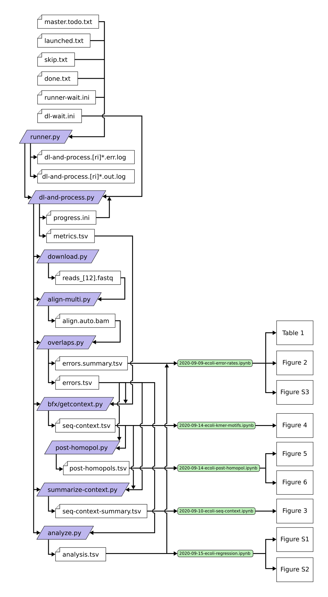

# Overlap error detection and analysis

The scripts in this directory perform the analysis referred to in Stoler _et al._ 2020 (in review).

## Dependencies

This repository depends on submodules, so be sure to clone it with `--recursive`.

To download data from the SRA, it requires the [`requests`](https://requests.readthedocs.io/en/master/) Python package.

This also assumes the presence of several commands on your `$PATH`:  
`curl`  
`gunzip`  
[`bioawk`](https://github.com/lh3/bioawk)  
[`bwa`](https://github.com/lh3/bwa) (0.7.17-r1188)  
[`samtools`](https://github.com/samtools/samtools) (1.9)  
Version numbers in parentheses are what the original analysis was done with. Other versions may also work.

## Usage

The contents of this repo were used to download hundreds of SRA FASTQ files, then use the overlap error detection method to detect errors, and then analyze the detected errors.

This took place in two phases: first, the main survey, where the Python scripts in the root directory were used to download and analyze the data on a cluster. Then, the results of this computation were analyzed in Jupyter Notebook. These notebooks are all in the `jupyter` directory.

### Setup

#### Reference sequences

First, you will need to download all the potential reference sequences for your SRA runs, as described in the methods section. Then, create a file mapping sequence names to the filenames of the FASTA files they're contained in. As described in the `align-multi.py` help text, this file should have one line per sequence, with two tab-delimited fields: the sequence name, and the path to the reference file. Then concatenate all the reference sequences into one meta-reference FASTA file (but keep the individual files). Then index the meta-reference with BWA.

#### SRA metadata

For the analysis in Jupyter Notebook, you'll need metadata for the SRA runs. You'll need it in two different formats: runinfo and docsum. You can get both using NCBI's Entrez Direct utilities.

For the runinfo, use a command like this:
```bash
$ esearch -db sra -query 'Escherichia coli[Organism]' | efetch -format runinfo > sra.runinfo.csv
```
The output will include many empty and header lines, so you'll probably want to remove those.

The docsums can be fetched like this:
```bash
$ esearch -db sra -query 'Escherichia coli[Organism]' | efetch -format docsum > sra.docsum.raw.xml
```
But this output is even messier. If there are many results, the output will be broken into multiple complete XML documents concatenated together. To work with the Jupyter Notebook code, it'll have to be one big, valid XML document. Remove the extra XML headers (the `<?xml`, `<!DOCTYPE`, `<DocumentSummarySet`, and `<\DocumentSummarySet>` lines).

### Running main analysis

The script `dl-and-process.py` can be used to perform the main computational analysis on a single SRA run. It takes an SRA accession number, and several paths, like the path to the meta reference file you created earlier and the sequence-to-filename mapping file. For compatibility with the Jupyter Notebook code, you should use the `--progress-file` option to track the progress of each run in a `progress.ini` file in the output directory. For the same reason, all output directories should be contained in a single `runs` parent directory.

### Jupyter Notebook analysis

At the top of each Jupyter Notebook, there are a few paths defined. Replace the `MAIN_DIR` with the path to the parent of your `runs` directory. And replace the `CSV_PATH` and `XML_PATH` with the paths to your runinfo and docsum metadata files, respectively.

The notebooks require `matplotlib`, `seaborn`, `pandas`, and `statsmodels` for the linear regression. Some use a module named `html_table`, which can be found in [this repo](https://github.com/NickSto/utillib). Others use `fastagenerators`, which is from [this repo](https://github.com/makovalab-psu/nick-bfx).

## Pipeline

This diagram shows the full flow of the analysis. We used `runner.py` to automate launching [`slurm`](https://slurm.schedmd.com/) jobs from a queue. For each SRA accession number, it would launch an instance of `dl-and-process.py`. This script would run the main pipeline, starting with `download.py` and ending in `analyze.py`. The exception is `post-homopol.py`, which was launched manually. The output and input files are in white. Then certain output files are used by the Jupyter notebooks (in green) to produce the tables and figures.


